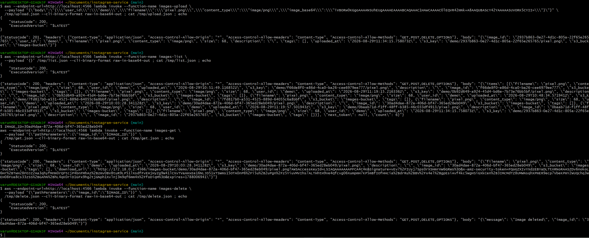
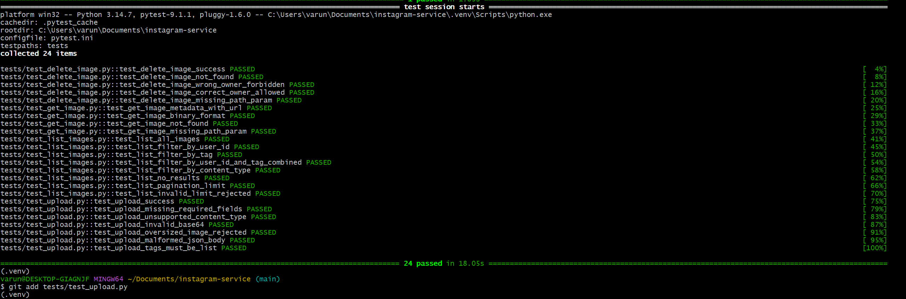

# Instagram-like Image Service (Serverless)

A scalable, serverless backend for uploading images with metadata, listing and
searching them, viewing/downloading them, and deleting them. Built entirely on
**Amazon API Gateway + AWS Lambda + Amazon S3 + Amazon DynamoDB**, written in
**Python 3.7+**, and fully runnable on your own machine using **LocalStack** -
no real AWS account required.

---

## Table of contents

1. Overview
2. Architecture (with diagram)
3. How a request flows through the system
4. Data model (S3 + DynamoDB)
5. Why this design scales
6. Project layout
7. Prerequisites
8. Running it on LocalStack (step by step)
9. Running the unit tests
10. API reference (all four endpoints)
11. Design decisions and trade-offs

---

## 1. Overview

This module is the service layer of an Instagram-like application. It is
responsible for two things that must always stay consistent with each other:

- The **image file itself** - stored as a binary object in Amazon S3.
- The image's **metadata** (who uploaded it, when, its tags, size, content
  type, etc.) - stored in Amazon DynamoDB, a NoSQL database.

Multiple users can use the service at the same time, so every component is
stateless and horizontally scalable.

The service exposes four HTTP APIs:

    POST   /images              Upload an image + its metadata
    GET    /images               List images, with searchable filters
    GET    /images/{image_id}    View / download a single image
    DELETE /images/{image_id}    Delete an image

---

## 2. Architecture

The system is fully serverless. A client makes an HTTPS request to API Gateway,
which routes it to one of four Lambda functions. Each Lambda talks to S3 (for
the image bytes) and/or DynamoDB (for the metadata).

    ```text
    Client (browser, mobile app, curl, Postman)
                        |
                        | HTTPS request
                        v
            +--------------------------------------+
            |           API Gateway (REST)         |
            |                                      |
            |  POST /images       GET /images      |
            |  GET /images/{id}   DELETE /images/{id} |
            +--------------------------------------+
                 |          |          |          |
                 |          |          |          |   (AWS_PROXY integration)
                 v          v          v          v
            +---------+ +---------+ +---------+ +---------+   AWS Lambda functions
            | upload  | |  list   | |   get   | | delete  |   (Python 3.7+)
            | Lambda  | | Lambda  | | Lambda  | | Lambda  |
            +---------+ +---------+ +---------+ +---------+
                 |          |          |          |
                 |          |          |          |
                 +-----+----+          +----+-----+
                       |                    |
                       v                    v
            +---------------------+  +--------------------------+
            |      Amazon S3       |  |     Amazon DynamoDB     |
            |                     |  |                          |
            | bucket:             |  | table: images-metadata  |
            | images-bucket       |  |                          |
            |                     |  | Primary key: image_id   |
            | object key:         |  | GSI: user_id-index      |
            | user_id/            |  |      (user_id +         |
            |   image_id/         |  |       uploaded_at)      |
            |     filename        |  |                          |
            |                     |  | (JSON-like metadata)     |
            | (raw image bytes)   |  |                          |
            +---------------------+  +--------------------------+
    ```

**Component roles at a glance:**

    Client       Sends HTTP requests and receives JSON (or image bytes).
    API Gateway  Public entry point. Maps each URL + HTTP method to a Lambda.
    Lambda       Stateless functions holding the business logic. One per API.
    S3           Object storage for the actual image files (the "blob").
    DynamoDB     NoSQL store for searchable metadata about each image.

---

## 3. How a request flows through the system

**Uploading an image (POST /images):**

1. Client sends JSON: user_id, filename, content_type, image_base64, tags.
2. API Gateway invokes the "upload" Lambda.
3. Lambda validates the input (required fields, allowed type, size <= 8 MB).
4. Lambda decodes the base64 image and PUTs the bytes into S3
   at key  user_id/image_id/filename.
5. Lambda writes the metadata record into DynamoDB.
6. If the DynamoDB write fails, the S3 object is deleted again so no
   "orphan" file is left behind (keeps the two stores consistent).
7. Lambda returns 201 Created with the stored metadata.

**Listing/searching images (GET /images):**

1. Client sends optional filters as query-string parameters.
2. API Gateway invokes the "list" Lambda.
3. If user_id is given, Lambda runs an efficient DynamoDB Query on the
   user_id-index GSI. Otherwise it runs a Scan.
4. Any of tag / content_type / date-range are applied as filters.
5. Results are paginated (limit + next_token) and returned as JSON.

**Viewing/downloading (GET /images/{image_id}):**

1. Lambda looks up the metadata in DynamoDB by image_id.
2. Default: returns metadata + a presigned S3 URL (a temporary, signed
   link the client can open directly to view/download the file).
3. With ?format=binary: Lambda reads the bytes from S3 and returns them
   base64-encoded with the correct Content-Type.

**Deleting (DELETE /images/{image_id}):**

1. Lambda looks up the metadata by image_id (404 if missing).
2. Optional ownership check: if a user_id is supplied and doesn't match
   the owner, returns 403.
3. Deletes the S3 object, then the DynamoDB record.

---

## 4. Data model

**S3 - the image bytes.** Each object is stored under a hierarchical key:

    images-bucket/
      L <user_id>/
          L <image_id>/
              L <filename>

Putting user_id first groups a user's files together, and image_id (a UUID)
guarantees uniqueness even if two users upload files with the same name.

**DynamoDB - the metadata.** One item (row) per image:

    {
      "image_id":      "3f2a...b9",                        <- primary (partition) key
      "user_id":       "u123",                              <- GSI partition key
      "filename":      "sunset.jpg",
      "content_type":  "image/jpeg",
      "size":          245678,
      "description":   "Sunset at the beach",
      "tags":          ["sunset", "beach"],
      "uploaded_at":   "2026-08-25T10:15:00.123456Z",        <- GSI sort key
      "s3_key":        "u123/3f2a...b9/sunset.jpg",
      "s3_bucket":     "images-bucket"
    }

The **Global Secondary Index (GSI)** `user_id-index` is keyed on
(user_id, uploaded_at). It lets "give me this user's images, newest first"
run as a targeted Query that only reads that user's items - instead of
scanning the entire table - which is what keeps the service fast as data grows.

---

## 5. Why this design scales

    Stateless compute  Lambda holds no state between calls, so AWS can run
                        thousands of copies in parallel for many simultaneous
                        users. Nothing to provision or size up.

    Managed storage     S3 and DynamoDB scale independently of the compute
                         layer and of each other.

    No hot partitions   image_id is a random UUID, so writes spread evenly
                         across DynamoDB partitions instead of piling onto one.

    Efficient reads      The user_id-index GSI turns per-user listing into a
                          Query (reads only that user's rows) rather than a Scan
                          (reads the whole table).

    Pagination            limit + next_token means a huge result set is served
                           in small pages, never loaded all at once.

---

## 6. Project layout

    instagram-service/
    |- docker-compose.yml        LocalStack container definition
    |- requirements.txt          runtime dependency (boto3)
    |- requirements-dev.txt      test dependencies (pytest, moto)
    |- pytest.ini                pytest configuration
    |- src/
    |   |- common/                shared helper modules
    |   |   |- clients.py         boto3 client/resource factory (LocalStack-aware)
    |   |   |- db.py              DynamoDB access: put/get/delete/list + filters
    |   |   |- storage.py         S3 access: upload/download/delete/presigned URL
    |   |   |- utils.py           request parsing + validation helpers
    |   |   L- responses.py       builds API Gateway HTTP responses
    |   L- handlers/               one Lambda entry point per endpoint
    |       |- upload.py          POST /images
    |       |- list_images.py     GET /images
    |       |- get_image.py       GET /images/{image_id}
    |       L- delete_image.py    DELETE /images/{image_id}
    |- tests/                    pytest + moto unit tests (one file per handler)
    L- scripts/                  LocalStack deploy / teardown / smoke-test

---

## 7. Prerequisites

    - Docker + Docker Compose      (to run LocalStack)
    - AWS CLI v2                   (the scripts call it)
    - Python 3.7+                  (to run the tests locally)
    - zip, curl                    (used by the scripts)
    - Optional: awslocal wrapper   (pip install localstack). If absent, the
      scripts fall back to: aws --endpoint-url=http://localhost:4566

---

## 8. Running it on LocalStack

LocalStack emulates AWS on your machine, so S3, DynamoDB, Lambda, and API Gateway all run locally in one Docker container. Make sure Docker Desktop is running first.

```bash
# 1. Start LocalStack
docker compose up -d

# 2. Wait until it reports healthy
curl http://localhost:4566/_localstack/health

# 3. Set credentials LocalStack accepts (any values work; required by the AWS CLI)
export AWS_ACCESS_KEY_ID=test
export AWS_SECRET_ACCESS_KEY=test
export AWS_DEFAULT_REGION=us-east-1

# 4. Create the S3 bucket + DynamoDB table, deploy the 4 Lambdas, wire up API Gateway
bash scripts/deploy_all.sh
```

LocalStack Community does not persist state, so re-run `deploy_all.sh` each time you restart LocalStack.

### Exercise the four endpoints

The deployed Lambda functions are invoked directly below (LocalStack Community's API Gateway HTTP routing is unreliable, so direct invoke demonstrates each endpoint against the real S3 + DynamoDB):

```bash
# UPLOAD
aws --endpoint-url=http://localhost:4566 lambda invoke --function-name images-upload \
  --payload "{\"body\":\"{\\\"user_id\\\":\\\"demo\\\",\\\"filename\\\":\\\"pixel.png\\\",\\\"content_type\\\":\\\"image/png\\\",\\\"image_base64\\\":\\\"iVBORw0KGgoAAAANSUhEUgAAAAEAAAABCAQAAAC1HAwCAAAAC0lEQVR42mNk+A8AAQUBAScY42YAAAAASUVORK5CYII=\\\"}\"}" \
  /tmp/upload.json --cli-binary-format raw-in-base64-out ; cat /tmp/upload.json ; echo

# LIST
aws --endpoint-url=http://localhost:4566 lambda invoke --function-name images-list \
  --payload '{}' /tmp/list.json --cli-binary-format raw-in-base64-out ; cat /tmp/list.json ; echo

# GET (replace IMAGE_ID with the image_id returned by UPLOAD)
IMAGE_ID=paste-image-id-here
aws --endpoint-url=http://localhost:4566 lambda invoke --function-name images-get \
  --payload "{\"pathParameters\":{\"image_id\":\"$IMAGE_ID\"}}" \
  /tmp/get.json --cli-binary-format raw-in-base64-out ; cat /tmp/get.json ; echo

# DELETE
aws --endpoint-url=http://localhost:4566 lambda invoke --function-name images-delete \
  --payload "{\"pathParameters\":{\"image_id\":\"$IMAGE_ID\"}}" \
  /tmp/delete.json --cli-binary-format raw-in-base64-out ; cat /tmp/delete.json ; echo
```

Tear everything down when finished:

```bash
bash scripts/teardown.sh
docker compose down -v
```


### LocalStack demo output

The four endpoints invoked against the deployed LocalStack stack (real S3 + DynamoDB)



## 9. Running the unit tests

The tests use **moto** to mock S3 and DynamoDB in memory, so they run in
seconds and need neither Docker nor LocalStack running.

    python -m venv .venv
    source .venv/Scripts/activate    # Windows Git Bash
    # source .venv/bin/activate      # macOS / Linux
    pip install -r requirements-dev.txt
    pytest

The suite covers, per endpoint: success paths, missing/invalid input,
unsupported content type, oversized images, all search filters (individually
and combined), pagination across pages, not-found (404), and the wrong-owner
(403) case on delete.



---

## 10. API reference

Base URL (LocalStack):

    http://localhost:4566/restapis/<api_id>/local/_user_request_

All responses are JSON (except binary download mode) and include CORS headers.
Errors use the shape:  { "error": "<message>", "details": { ... } }

### POST /images  - upload an image with metadata

Request body (application/json):

    Field          Required  Description
    -----          --------  -----------
    user_id        yes       ID of the uploading user (the owner)
    filename       yes       Original file name, e.g. "sunset.jpg"
    content_type   yes       One of: image/jpeg, image/png, image/gif, image/webp
    image_base64   yes       Image bytes, base64-encoded. A data-URL prefix
                              ("data:image/png;base64,...") is also accepted.
    description    no        Free-text caption
    tags           no        List of strings, used later for search filtering

Rules: decoded image must be non-empty and <= 8 MB.

Example:

    curl -X POST "$BASE_URL/images" \
      -H "Content-Type: application/json" \
      -d '{
        "user_id": "u123",
        "filename": "sunset.jpg",
        "content_type": "image/jpeg",
        "image_base64": "'"$(base64 -w0 sunset.jpg)"'",
        "description": "Sunset at the beach",
        "tags": ["sunset", "beach"]
      }'

Success (201):

    {
      "image_id": "3f2a...b9",
      "user_id": "u123",
      "filename": "sunset.jpg",
      "content_type": "image/jpeg",
      "size": 245678,
      "description": "Sunset at the beach",
      "tags": ["sunset", "beach"],
      "uploaded_at": "2026-08-25T10:15:00.123456Z",
      "s3_key": "u123/3f2a...b9/sunset.jpg",
      "s3_bucket": "images-bucket"
    }

Errors: 400 (missing/invalid field, bad base64, unsupported type, too large).

### GET /images  - list / search images

All query parameters are optional and can be combined:

    Parameter      Description
    ---------      -----------
    user_id        Exact match. Uses the user_id-index GSI (efficient).
    tag            Matches images whose "tags" list contains this value.
    content_type   Exact match, e.g. image/png.
    start_date     ISO-8601 lower bound (inclusive) on uploaded_at.
    end_date       ISO-8601 upper bound (inclusive) on uploaded_at.
    limit          Page size, default 20, maximum 100.
    next_token     Opaque cursor from a previous response, for the next page.

Example - two filters combined (user_id + tag):

    curl "$BASE_URL/images?user_id=u123&tag=sunset"

Success (200):

    {
      "items": [ { ...image metadata... }, ... ],
      "next_token": null,
      "count": 1
    }

If next_token is not null, pass it back as ?next_token=... to fetch the next
page.

### GET /images/{image_id}  - view / download

    Default (?format=url):    returns metadata + a presigned S3 "download_url"
                               (a temporary signed link, valid ~1 hour) the
                               client can open directly.
    ?format=binary:            returns the raw image bytes, base64-encoded, with
                                the correct Content-Type and a Content-Disposition
                                attachment header.

Examples:

    curl "$BASE_URL/images/3f2a...b9"
    curl "$BASE_URL/images/3f2a...b9?format=binary" --output downloaded.jpg

Errors: 404 if the image does not exist.

### DELETE /images/{image_id}  - delete

Deletes both the S3 object and the DynamoDB record. If a user_id query
parameter is supplied, it must match the image's owner or the call is rejected.

Example:

    curl -X DELETE "$BASE_URL/images/3f2a...b9?user_id=u123"

Success (200):

    { "message": "Image deleted", "image_id": "3f2a...b9" }

Errors: 404 (not found), 403 (user_id does not match the owner).

---

## 11. Design decisions and trade-offs

**Base64-in-JSON uploads instead of multipart/binary.** Simpler and behaves
identically on LocalStack and real AWS. Trade-off: ~33% payload size overhead
and a ceiling set by the API Gateway payload limit (10 MB on real AWS). For
very large files you would instead hand the client a presigned S3 PUT URL and
let it upload straight to S3.

**Best-effort ownership check on delete.** There is no authentication layer in
this module, so delete trusts an optional user_id query parameter. In
production this identity would come from an API Gateway authorizer (e.g.
Amazon Cognito) rather than a query string.

**Query by user, Scan otherwise.** Listing by user_id uses the GSI Query and
stays cheap at any scale. Unfiltered listing uses a Scan with a filter, which
is fine for a demo/portfolio-scale dataset; a production hot-path for
unfiltered browsing would add more GSIs.

**UUID image IDs.** Chosen over sequential IDs so writes spread across
DynamoDB partitions and never form a single-partition bottleneck.


